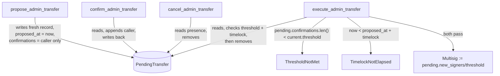

# Access-Control Multisig / Timelock Audit

**Scope:** `contracts/access-control/src/lib.rs`, `contracts/access-control/src/test.rs`
**Focus:** timelock enforcement across every code path that consumes a `PendingAdminTransfer`, and the surrounding multisig admin-transfer flow
**Related issue:** #151

---

## Executive Summary

**Timelock enforcement: correct.** `PendingAdminTransfer` is consumed in
exactly one place — `execute_admin_transfer` — and that single call site
checks the timelock correctly: `now < pending.proposed_at.saturating_add(timelock)`
returns the typed `AcError::TimelockNotElapsed`, not a panic, and this is
checked *after* confirming the threshold is met but *before* any state is
mutated. There is no other function that reads, writes, or otherwise acts
on the signer set based on a `PendingAdminTransfer` without going through
this gate. Supersession (a second `propose_admin_transfer` before the
first is executed) is also handled correctly: it fully overwrites the
`PendingTransfer` storage slot with a fresh record — a new `proposed_at`
(restarting the timelock) and a confirmations list containing only the new
proposer — so a proposal that already reached its confirmation threshold
loses that progress entirely if superseded, rather than letting a
replacement borrow it.

**Finding: `has_role` did not grant admin-signer superuser status for
non-`Admin` roles**, contradicting its own doc comment and the crate's
`require_role` guard (which correctly does grant it). Not a timelock bug —
found while reading through the same file for this audit, and fixed here
since it's squarely in scope (`contracts/access-control/src/lib.rs`) and
was one of the underlying causes of the workspace never having had a
passing test run (see `fix/contracts-workspace-build`, which this branch
is built on — that fix is included here as a prerequisite, not repeated).

No other issues found in the timelock/multisig flow.

---

## Call graph: every `PendingAdminTransfer` consumer



Only `execute_admin_transfer` mutates `AcKey::Multisig` (the live signer
set). `propose`/`confirm`/`cancel` only ever touch `AcKey::PendingTransfer`.
There is no second path — no other function in this crate, and no function
in `invoice`/`financing-pool`/`settlement` (none of which re-implement any
part of this flow; they all delegate to `AccessControl`) — that reads a
`PendingAdminTransfer` and acts on it.

## What was checked

**1. Claiming before the timelock elapses.** `execute_admin_transfer`
computes `pending.proposed_at.saturating_add(timelock)` and compares
against `env.ledger().sequence()` with `<`, returning
`Err(AcError::TimelockNotElapsed)` — a typed error via the function's
`Result` return, not a panic. Confirmed by a new test,
`execute_before_timelock_elapses_returns_typed_error_not_panic`, which
pins the exact boundary: one ledger short of the timelock still rejects
(and leaves the pending transfer intact — rejection isn't destructive),
and one ledger later it succeeds.

**2. Supersession safety.** A second `propose_admin_transfer` before the
first is executed completely replaces the stored `PendingAdminTransfer` —
`new_signers`, `new_threshold`, `proposed_at`, and `confirmations` are all
freshly constructed, none copied from the prior record. Confirmed by a new
test, `second_proposal_before_first_is_claimed_does_not_inherit_its_progress`,
which specifically constructs the worst case: the first proposal reaches
full confirmation *and* its timelock duration fully elapses (so it would
be immediately executable) before it's superseded. The test asserts the
replacement proposal starts over at 1 confirmation, fails `ThresholdNotMet`
until independently reconfirmed, and — even after reconfirming — still
fails `TimelockNotElapsed` until its *own* `proposed_at` plus timelock is
reached, despite the elapsed ledger time already exceeding what the first
proposal needed. This is the scenario a supersession bug would most
plausibly show up in (an attacker superseding a stalled proposal to
"inherit" its already-elapsed timelock), and it doesn't.

**3. Threshold-change edge case: reducing to 1 after the multisig is
active.** `execute_admin_transfer` gates on `current.threshold` (the
signer set in effect *before* this transfer), never `pending.new_threshold`
— so reducing to a 1-of-1 committee still requires the existing committee's
full threshold to authorize the change, not the new, weaker one.
`validate_signer_set` accepts `threshold == 1` for a single-signer set
(`threshold > signers.len()` is the only upper-bound check). Confirmed by
a new test, `threshold_reduced_to_one_after_multisig_active`, which drives
a real 2-of-3 → 1-of-1 transfer through the full propose/confirm/execute
flow and then verifies the resulting single-signer committee is itself
fully functional — the sole signer can propose, auto-confirm, and (after
the timelock) execute a further transfer alone.

## Finding: `has_role` superuser gap (fixed)

```rust
// before
pub fn has_role(env: &Env, role: Role, addr: &Address) -> bool {
    if let Role::Admin = role {
        return Self::is_signer(env, addr);
    }
    env.storage().instance().has(&AcKey::RoleHolder(role, addr.clone()))
}
```

The module doc comment states operational roles are superuser-accessible
to any admin signer, and `require_role` (the guard actually used to gate
real operations) correctly implements that: `Self::is_signer(env, caller)
|| Self::has_role(env, role, caller)`. But `has_role` itself — the
*query* function, used directly by consuming contracts' own `has_role`
passthroughs and read by any off-chain caller checking "does this address
have permission X" — only special-cased `Role::Admin`. A signer who was
never explicitly granted `Pauser`/`OracleWriter`/`LiquidityManager` would
report `has_role(Role::Pauser, signer) == false`, even though
`require_role(Role::Pauser, signer)` — the actual authorization check —
would let them through. Fixed to check `is_signer` first for every role,
consistent with `require_role`.

This was caught by a pre-existing (but, until `fix/contracts-workspace-build`,
never-run) test: `signer_holds_admin_role_and_every_operational_role_as_superuser`,
whose own comment already documented the intended behavior.

## Test coverage

`cargo test -p access-control` passes: 26 tests (23 pre-existing,
unmodified, + the 3 new ones described above), 0 failures.
