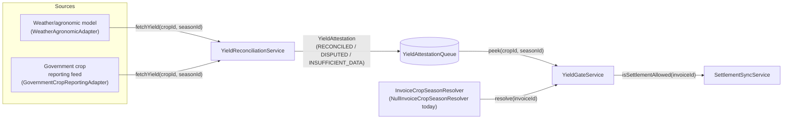

# Crop-Yield Oracle Pipeline

**Status:** design + stub implementation (issue #159)
**Code:** `backend/src/oracle/`
**Related:** `docs/protocol-spec.md` (crop-yield verification is listed there as a known gap, tracked as issue #50); this document is the design for closing that gap off-chain, ahead of any on-chain attestation work.

---

## Problem

The protocol currently has no verification that a harvest backing a funded
invoice actually happened, or happened at the yield the invoice claims.
`protocol-spec.md` calls this out explicitly: *"there is no on-chain or
attested off-chain crop-yield verification today."* This document designs
the off-chain half of closing that gap: an ingestion pipeline that pulls
yield data from multiple independent sources, reconciles disagreements
between them, and produces a yield attestation that downstream processes —
starting with settlement — can optionally require before treating an
invoice as fully resolved.

**Explicitly out of scope** (per issue #159): production API keys/real
upstream integrations, satellite image processing, and — discovered while
implementing this — any change to the `Invoice` database schema to
actually associate an invoice with a crop/season. That last point matters:
today, nothing in the codebase records which crop or growing season a
given invoice's harvest belongs to (the `Invoice` model has `farmer` and
`faceValue`, no `cropId`/`seasonId`). This pipeline is therefore designed,
implemented, and tested end-to-end, and wired into settlement as an
**opt-in, currently-inert** gate — see "Integration with settlement" below
— rather than something that already changes any invoice's real settlement
behavior today.

## Architecture



Each box is a small, independently-testable seam:

| Component | File | Role |
|---|---|---|
| `YieldDataAdapter` | `yield-data-adapter.interface.ts` | One upstream source. `fetchYield(cropId, seasonId): Promise<YieldReading>`, normalized to kg/hectare. |
| `WeatherAgronomicAdapter`, `GovernmentCropReportingAdapter` | `adapters/*.ts` | Stub implementations backed by in-memory fixtures. |
| `YieldReconciliationService` | `yield-reconciliation.service.ts` | Queries every adapter, applies the reconciliation policy, writes a `YieldAttestation`. |
| `YieldAttestationQueue` | `yield-attestation-queue.ts` | Where the latest attestation per crop/season lives. In-memory stub today. |
| `InvoiceCropSeasonResolver` | `invoice-crop-season-resolver.ts` | Maps an invoice to the crop/season it's gated on, if any. Null (always "not gated") today. |
| `YieldGateService` | `yield-gate.service.ts` | The one thing `SettlementSyncService` calls: "is this invoice clear to settle?" |

## Reconciliation logic

`YieldReconciliationService.reconcile(cropId, seasonId)`:

1. Calls `fetchYield(cropId, seasonId)` on every configured adapter via
   `Promise.allSettled` — one slow or failing source never blocks or
   fails the others.
2. Every fulfilled promise contributes a `YieldReading`; every rejection
   is logged (source id + reason) and otherwise dropped.
3. Builds a `YieldAttestation` from whatever readings came back:

   | Readings received | Outcome |
   |---|---|
   | 0 | `INSUFFICIENT_DATA` — no `finalYieldKgPerHectare`. |
   | 1 | `RECONCILED`, using that single reading as-is (nothing to reconcile against — noted in `notes`). |
   | 2+, agree within tolerance | `RECONCILED`, `finalYieldKgPerHectare` = arithmetic mean. |
   | 2+, disagree beyond tolerance | `DISPUTED` — no `finalYieldKgPerHectare`; `notes` lists every source's figure for a human to review. |

   "Agree within tolerance" is `(max - min) / mean <= toleranceRatio`
   across all reading values, `toleranceRatio` defaulting to `0.05` (5%),
   configurable via `ReconciliationPolicy` (DI token
   `RECONCILIATION_POLICY` in `oracle.module.ts`).
4. Writes the attestation to the queue (superseding any prior attestation
   for the same crop/season) and returns it.

This is intentionally a simple, auditable rule (mean ± tolerance), not a
statistical outlier-rejection model: with only two sources today, a
"majority vote" or trimmed-mean approach degenerates to the same thing,
and the simpler rule is easier to reason about when an operator is staring
at a `DISPUTED` attestation trying to understand why. Revisit if/when a
third independent source is added — at that point median-based
reconciliation becomes meaningful and is the natural upgrade.

**Why disagreement blocks rather than picks a winner:** the point of
using two independent sources is that neither is trusted unilaterally. If
reconciliation silently preferred one source on disagreement, an operator
who compromised or corrupted that one source could unilaterally set the
attested yield — exactly the single-point-of-failure this pipeline exists
to avoid. `DISPUTED` is the correct terminal state for genuine
disagreement; resolving it is a human/operational decision (see Failure
modes), not something the reconciliation policy should paper over
automatically.

## Failure modes

| Failure | Handling |
|---|---|
| One adapter is unreachable/errors | Logged, excluded from this reconciliation; the other source(s) still produce an attestation (degrades from "2-of-2 agreement" to "1 source, used as-is" — see the table above). |
| All adapters fail or have no data for this crop/season | `INSUFFICIENT_DATA`. No attestation is written that could be mistaken for a real figure — `finalYieldKgPerHectare` is `undefined`, and `YieldGateService` treats this the same as `DISPUTED`: blocks settlement (when the gate is enabled and the invoice is gated), doesn't fail it. |
| Sources disagree beyond tolerance | `DISPUTED`. Every contributing reading is kept in the attestation for audit. Resolution today is manual: an operator investigates (a mis-reported government figure, a stale weather-model run, a genuine crop-ID mismatch between sources are all plausible causes) and either corrects the upstream data and re-runs reconciliation, or overrides the gate for that invoice out-of-band. An automated appeals/override flow is future work. |
| The yield gate blocks a settlement-eligible invoice | `SettlementSyncService` treats this exactly like its existing "event failed after all retries" path: the sync cursor is held before this event (not skipped, not advanced past it), so the invoice is re-checked every poll cycle and settles automatically the moment reconciliation produces a usable attestation. It is never silently dropped. |
| A source returns a reading with an obviously-wrong value (negative, zero, absurdly large) | Not filtered by this pipeline today — normalization/sanity-bounding is an adapter responsibility per source (a real adapter should reject or flag implausible upstream values before they ever become a `YieldReading`). Tracked as a gap for when real adapters replace the stubs; the stub adapters' fixture data is by construction plausible, so this path isn't exercised by the current tests. |

## Data retention policy

The `YieldAttestationQueue` stub is in-memory (process-lifetime only,
deliberately — see "Out of scope" above). For a production, durable
implementation, the intended retention model — matching the
`WebhookDelivery` pattern already used elsewhere in this codebase — is:

- **Attestations**: retained indefinitely, keyed by `(cropId, seasonId)`,
  superseded (not deleted) by a later reconciliation for the same key —
  i.e. keep history, always serve the latest on `peek`. Attestations are
  the audit trail for "why did/didn't this invoice settle," and are cheap
  (small, infrequent — at most one per crop/season per reconciliation
  run, not per invoice).
- **Individual readings**: retained as long as their containing
  attestation, embedded in it (as they are in the current in-memory
  shape) rather than as a separately-queryable table, since they're only
  ever consumed alongside their attestation.
- **No PII**: `cropId`/`seasonId`/`yieldKgPerHectare`/`sourceId` carry no
  personal data, so this pipeline has no `@privacy` retention obligations
  of the kind already annotated on `Invoice.farmer`/`Invoice.investor` in
  `backend/prisma/schema.prisma` — crop-yield data is agricultural, not
  personal, information.

This is a target design for the eventual durable queue implementation, not
a claim about the current in-memory stub (which, again, does not persist
across process restarts — acceptable for a stub explicitly scoped to not
include a production data store).

## Integration with settlement

`SettlementSyncService.syncOnce()` calls
`YieldGateService.isSettlementAllowed(invoiceId)` immediately before
attempting to settle each parsed event, in place before the existing
retry/cursor logic:

```ts
if (!(await this.yieldGate.isSettlementAllowed(parsed.invoiceId))) {
  this.logger.warn(/* ... */);
  await this.cursor.setLastLedger(Math.max(0, safeLedger));
  return { processed, settled };
}
```

`isSettlementAllowed` is `true` (a no-op) whenever:

- `YIELD_GATE_ENABLED` is not `"true"` (the default — every existing
  deployment is unaffected), **or**
- the invoice has no crop/season association, per
  `InvoiceCropSeasonResolver` — and today, since the `Invoice` model has
  no crop/season columns, `NullInvoiceCropSeasonResolver` (the only bound
  implementation) always returns "no association" for every invoice.

So today, with real data, the gate is wired end-to-end and fully tested,
but is a no-op in production: no invoice is currently associated with a
crop/season, so `isSettlementAllowed` always returns `true` and settlement
behavior is unchanged. Turning it into a real gate requires two follow-up
pieces, both intentionally deferred past this issue's scope:

1. Add `cropId`/`seasonId` (nullable) columns to `Invoice`, populated at
   invoice-minting time.
2. Replace `NullInvoiceCropSeasonResolver`'s binding in `oracle.module.ts`
   with a Prisma-backed implementation reading those columns — no changes
   needed to `YieldGateService` or `SettlementSyncService` at that point,
   since both only depend on the `InvoiceCropSeasonResolver` interface.

## Test coverage

`backend/src/oracle/**/*.spec.ts` (10 suites, 63 tests) covers: both stub
adapters' fixture lookups and not-found behavior; every reconciliation
outcome (`RECONCILED` via single-source and via agreement, the exact
tolerance boundary, `DISPUTED`, `INSUFFICIENT_DATA`, adapter-failure
resilience); the in-memory queue's peek/enqueue/supersession semantics;
and `YieldGateService`'s full decision table (disabled, ungated, missing
attestation, disputed, insufficient data, reconciled).
`settlement-sync.service.spec.ts` adds two tests for the integration
point: a blocked invoice defers without failing (cursor held, event
re-checked next cycle), and an allowed invoice settles exactly as before.
