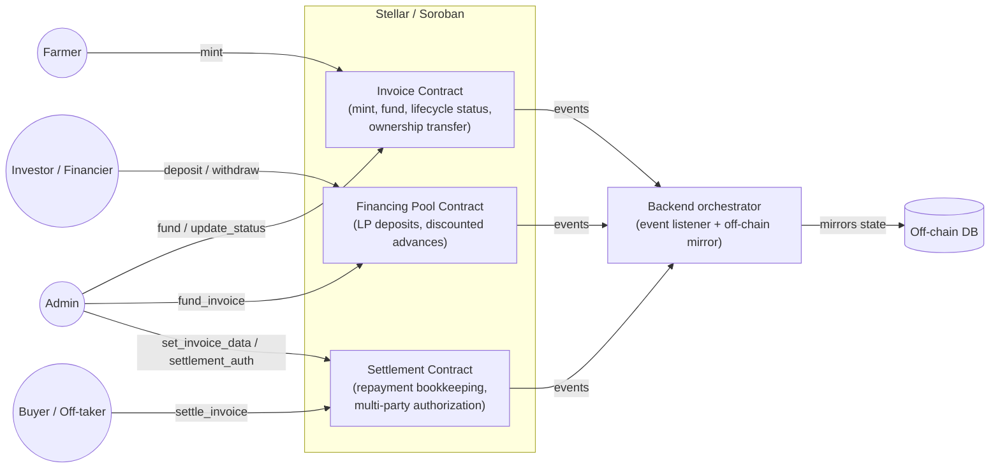
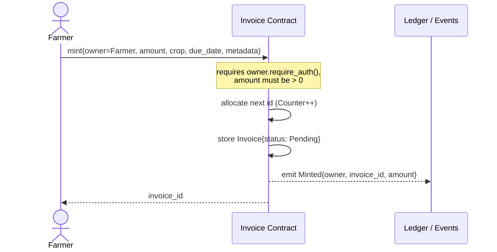
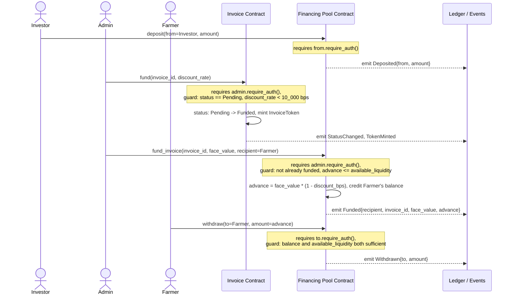
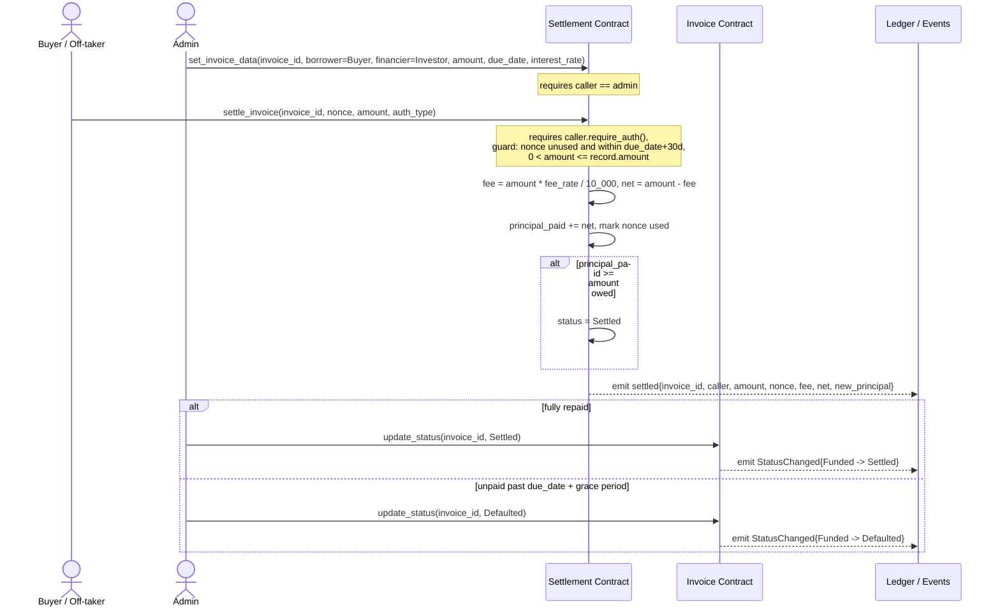

# InvoiceFi Stellar — Protocol Specification

This document is the authoritative reference for the InvoiceFi Stellar protocol: the
invoice lifecycle state machine, the canonical on-chain and off-chain data structures,
the invariants the protocol must preserve, and the trust assumptions made about each
actor. It describes the **intended protocol behavior** as expressed by the contract
interfaces and event schemas; it is not a code walkthrough or an API reference.

Out of scope: REST/API reference documentation, and line-by-line contract code
walkthroughs.

## 1. System Overview

InvoiceFi Stellar lets a farmer tokenize a future harvest as an on-chain invoice,
receive discounted working capital from investors ahead of harvest, and settle that
advance once the harvest is sold. The protocol is implemented as three independent
Soroban contracts, each with its own administrator and storage, coordinated by an
off-chain backend that observes contract events and drives the next call in sequence:

**Important architectural fact:** the three contracts make **no cross-contract calls**
to one another. Each depends only on `soroban-sdk`. Any consistency between "this
invoice is Funded in the Invoice Contract" and "this invoice has an advance recorded in
the Financing Pool Contract" is an off-chain/orchestration-level property, enforced by
whichever party (today, a trusted admin key per contract) calls the contracts in the
correct order — it is **not** atomically enforced by the ledger. See [§7 Trust
Model](#7-trust-model) and [invariant 17](#protocol-level).

## 2. Actors

| Actor | Role |
|---|---|
| **Farmer** | Mints invoices against a future harvest; initially owns the invoice/ownership token; receives the discounted advance. |
| **Investor / Financier** | Deposits liquidity into the Financing Pool; may hold the invoice ownership token after it is funded/transferred; is owed repayment recorded by the Settlement Contract. |
| **Buyer / Off-taker** | The counterparty who purchases the harvest and pays down the invoice via the Settlement Contract (`settlement`'s `borrower` field). |
| **Admin** | A single privileged `Address` per contract (three separate admin keys — one per contract, not necessarily the same party) that authorizes funding, status transitions, fee configuration, and invoice-data registration. |
| **Backend orchestrator** | Off-chain service that listens to contract events, mirrors invoice state into a database (see [§4.2](#42-off-chain-data-structures)), and (today) is the de facto driver of the admin-authorized calls across contracts. |

## 3. Invoice Lifecycle State Machine

The invoice's canonical lifecycle status lives in the **Invoice Contract**
(`contracts/invoice`). This is the single source of truth for `Status`.

```mermaid
stateDiagram-v2
    [*] --> Pending: mint(owner, amount, crop, due_date, metadata)\nguard: owner.require_auth(); amount > 0
    Pending --> Funded: fund(invoice_id, discount_rate)\nguard: admin.require_auth();\n0 <= discount_rate < 10_000 bps;\nside effect: mints InvoiceToken
    Pending --> Defaulted: update_status(Defaulted)\nguard: admin.require_auth()
    Funded --> Settled: update_status(Settled)\nguard: admin.require_auth()
    Funded --> Defaulted: update_status(Defaulted)\nguard: admin.require_auth()
    Settled --> [*]: terminal
    Defaulted --> [*]: terminal
```

**Guards and notes:**

- `Pending -> Funded` is reachable only through `fund`, never through `update_status`
  directly — `update_status` explicitly excludes that pair so the ownership token is
  always minted as part of the transition (never bypassed).
- `discount_rate` is expressed in basis points and must be strictly below `10_000`
  (100%); a value of `10_000` or above is rejected before any state change.
- `Settled` and `Defaulted` are **terminal**: no `(from, to)` pair starting from either
  is permitted; any attempted transition out of a terminal state fails.
- Every transition emits a `StatusChanged { invoice_id, from, to }` event; `fund`
  additionally emits `TokenMinted`.

### 3.1 Ownership sub-flow (orthogonal to lifecycle status)

Ownership of the invoice (and, once tokenized, of its `InvoiceToken`) is tracked
independently of `Status` and can change hands via `transfer` or an approve/
`transfer_from` pair (an ERC-20-style allowance for a single invoice id):

```mermaid
stateDiagram-v2
    [*] --> NoApproval
    NoApproval --> Approved: approve(owner, spender, id)\nguard: owner.require_auth(); invoice is tokenized; caller is owner
    Approved --> NoApproval: transfer_from(spender, from, to, id)\nguard: spender == approved address; consumes approval
    Approved --> Approved: approve(owner, new_spender, id)\n(overwrites prior approval)
    NoApproval --> NoApproval: transfer(from, to, id)\nguard: from == owner; from != to
```

- A direct `transfer` (not via `transfer_from`) always clears any outstanding approval
  for that invoice id, so a stale approval never survives a change of owner.
- **Transfers of any kind are blocked once `Status == Settled`** (`TransferAfterRepayment`)
  — the repayment claim has been discharged and the owner at settlement time is
  final. A `Defaulted` invoice's claim (bad debt) remains transferable, since default is
  not repayment.
- Self-transfer (`from == to`) is always rejected.

### 3.2 Protocol-level composite view

The Financing Pool and Settlement contracts model the economic events that,
conceptually, accompany the invoice's `Funded` and `Settled` transitions, without being
invoked by (or invoking) the Invoice Contract:

| Invoice Contract state | Corresponding Financing Pool event | Corresponding Settlement event |
|---|---|---|
| `Pending` | liquidity may already be deposited and idle | invoice data may already be registered (`set_invoice_data`) |
| `Funded` (post `fund`) | `fund_invoice` advances `face_value - discount` to the farmer | multi-party authorization (`settlement_auth` / `request_settlement_auth`) may begin |
| `Settled` | (no further pool action; the advance was already paid out) | `settle_invoice` accepted enough principal to fully discharge the invoice amount |
| `Defaulted` | (no further pool action; the advance is a realized loss to the pool's LPs) | no successful `settle_invoice` reaches full principal before/at expiry |

## 4. Canonical Data Structures

### 4.1 On-chain

All three contracts use a `category` + `id` `Symbol` pair as their storage key shape
(an ad hoc keyed map rather than a single `contracttype` enum in two of the three
crates). Storage location (`instance` vs. `persistent`) and TTL policy are noted per
field. Sizes below are **order-of-magnitude estimates** based on field types (a
`Symbol` is small, ≤32 chars; an `Address` is a 32-byte public key plus XDR envelope
overhead; `i128`/`u64` are fixed-width) — they are not measured Soroban footprint
figures. Precise entry sizes and rent costs should be obtained from
`stellar contract` footprint/simulation output before relying on them for fee
budgeting.

#### Invoice Contract (`contracts/invoice`)

| Storage key | Storage class | Value type | Notes / est. size |
|---|---|---|---|
| `Admin` | instance | `Address` | ~36 B |
| `Counter` | instance | `u64` | 8 B; monotonic invoice-id allocator |
| `Invoice(id: u64)` | persistent, TTL-extended on every write (~1 day threshold / ~7 day extension) | `Invoice { id: u64, owner: Address, amount: i128, crop: Symbol, due_date: u64, metadata: String, status: Status }` | ~120–300 B depending on `metadata` URI length |
| `Token(id: u64)` | persistent, TTL-extended | `InvoiceToken { invoice_id: u64, face_value: i128, discount_rate: u32, due_date: u64 }` | ~60 B; presence marks the invoice tokenized |
| `Approval(id: u64)` | persistent, TTL-extended | `Address` | ~36 B; removed on transfer |

`Status` is a `u32`-backed enum: `Pending = 0`, `Funded = 1`, `Settled = 2`,
`Defaulted = 3`.

#### Financing Pool Contract (`contracts/financing-pool`)

| Storage key | Storage class | Value type | Notes / est. size |
|---|---|---|---|
| `Admin` | instance | `Address` | ~36 B |
| `DiscountBps` | instance | `u32` | 4 B; funding discount, basis points |
| `Available` | instance | `i128` | 16 B; un-deployed pool liquidity |
| `Balance(addr: Address)` | persistent | `i128` | 16 B; withdrawable claim per address |
| `Funding(invoice_id: u64)` | persistent | `Funding { invoice_id: u64, face_value: i128, advance: i128, recipient: Address }` | ~76 B; written at most once per invoice id |

The pool tracks **internal ledger claims**, not a live SEP-41 token balance — deposits
and withdrawals adjust bookkeeping entries rather than moving an external asset
contract-to-contract. A production deployment settles these claims against a real
SEP-41 token in the settlement layer; the pool's job is discount accounting, not
custody.

#### Settlement Contract (`contracts/settlement`)

| Storage key | Storage class | Value type | Notes / est. size |
|---|---|---|---|
| `instance("ADMIN")` | instance | `Address` | ~36 B |
| `instance("FEE_RATE")` | instance | `u32` | 4 B; basis points taken on each `settle_invoice` |
| `instance("COLLECTED_FEES")` | instance | `i128` | 16 B; cumulative fees taken, not yet withdrawn |
| `instance("WITHDRAWN_FEES")` | instance | `i128` | 16 B; cumulative fees paid out via `withdraw_fees` |
| `instance("ESCROW_PUBKEY")` | instance | `BytesN<32>` | 32 B; escrow signing key for off-chain settlement attestations |
| `invoice_data(invoice_id: Symbol)` | persistent | `InvoiceRecord { id, borrower: Address, financier: Address, amount: i128, due_date: u64, principal_paid: i128, interest_paid: i128, status: u32, lender_approved: bool, payer_approved: bool, is_funded: bool, lender_allowed: bool, payer_allowed: bool, approval_status: u32 }` | ~150–200 B |
| `nonce_meta(invoice_id: Symbol)` | persistent | `NonceMeta { invoice_id: Symbol, used_nonces: Vec<u64>, due_date: u64 }` | grows with number of settlement calls; ~16 B + 8 B per used nonce |

`SettlementStatus` is a `u32`-backed enum: `ApprovedForSettlement = 0`,
`LenderApproved = 1`, `PayerApproved = 2`, `Settled = 3`, `ReleaseRejected = 9`.

A nonce is valid for `settle_invoice` only if it has not been previously accepted for
that invoice **and** the current ledger timestamp is at or before
`due_date + 2_592_000` seconds (30 days past due).

### 4.2 Off-chain data structures

The backend mirrors on-chain invoice state into PostgreSQL via Prisma
(`backend/prisma/schema.prisma`) so the frontend can query without hitting the ledger
directly:

| Model | Field | Type | Notes |
|---|---|---|---|
| `Invoice` | `id` | `Int` (autoincrement) | Off-chain primary key |
| | `onchainId` | `BigInt` (unique) | Join key: the Invoice Contract's `u64` invoice id |
| | `status` | `InvoiceStatus` enum: `PENDING \| FUNDED \| REPAID \| DEFAULTED` | Off-chain mirror of on-chain `Status` (`REPAID` corresponds to on-chain `Settled`) |
| | `faceValue` | `BigInt` | Mirrors `Invoice.amount` |
| | `farmer`, `investor` | `String`, `String?` | Stellar addresses as text |
| | `settledLedger` | `Int?` | Ledger sequence at which settlement was observed |
| | `settledAt` | `DateTime?` | Wall-clock time the listener recorded settlement |
| `SyncCursor` | `lastLedger` | `Int` | Singleton row; last Soroban ledger the event listener has processed, so polling resumes correctly after a restart |

Note the naming mismatch between layers: the on-chain `Status::Settled` is mirrored as
`InvoiceStatus.REPAID` off-chain — both denote the same terminal, fully-repaid state.

## 5. Invariants

These are protocol invariants stated in falsifiable form: each names a concrete
observation that would disprove it.

#### Invoice Contract

1. **State-graph closure.** An invoice's `status` changes only along one of the four
   edges `{Pending→Funded, Pending→Defaulted, Funded→Settled, Funded→Defaulted}`.
   *Falsified by:* any successful transition recorded between a pair not in that set.
2. **Terminal immutability.** Once `status ∈ {Settled, Defaulted}`, it never changes
   again. *Falsified by:* a `StatusChanged` event with `from ∈ {Settled, Defaulted}`.
3. **Positive face value.** `amount > 0` holds for every stored `Invoice`, for its
   entire lifetime (checked at mint; never mutated afterward). *Falsified by:* any
   `Invoice` record with `amount <= 0`.
4. **Single tokenization.** An `InvoiceToken` for a given invoice id is written at
   most once, and only as a side effect of the `Pending → Funded` transition.
   *Falsified by:* two distinct `TokenMinted` events for the same `invoice_id`, or a
   `Token` entry whose `invoice_id` was never `Pending`.
5. **Bounded discount.** Every stored `InvoiceToken.discount_rate` is strictly less
   than `10_000` basis points. *Falsified by:* any `InvoiceToken` with
   `discount_rate >= 10_000`.
6. **No transfer after repayment.** No successful `transfer` or `transfer_from`
   changes an invoice's owner while `status == Settled`. *Falsified by:* a
   `Transferred` event for an invoice whose status was already `Settled` at call time.
7. **Approval consumption.** Every successful `transfer`/`transfer_from` clears the
   `Approval` entry for that invoice id; no approval survives a change of owner.
   *Falsified by:* `get_approved` returning a value for an invoice immediately after a
   transfer, with no intervening `approve` call.
8. **Monotonic id allocation.** Invoice ids are assigned from a strictly increasing
   counter starting at 1, and no id is ever reused. *Falsified by:* two distinct
   `Invoice` records sharing an id, or an id greater than the current `total_minted()`.

#### Financing Pool Contract

9. **Liquidity conservation.** At every point in time,
   `available_liquidity = Σ(deposits) − Σ(advances via fund_invoice) − Σ(withdrawals)`,
   and `available_liquidity >= 0`. *Falsified by:* the equation failing to hold after
   any sequence of `deposit`/`withdraw`/`fund_invoice` calls, or a negative value.
10. **Funding immutability.** For a given `invoice_id`, `fund_invoice` succeeds at
    most once; the resulting `Funding` record is never overwritten. *Falsified by:*
    two different `Funding` records (differing `face_value` or `advance`) for the same
    `invoice_id`.
11. **Pool-favoring rounding.** `advance = floor(face_value * (10_000 − discount_bps) / 10_000)`,
    which satisfies `advance <= face_value`, and any rounding remainder is retained by
    the pool, never advanced to the recipient. *Falsified by:* `advance > face_value`,
    or a computed advance one unit higher than the floor-division result.
12. **Withdrawal solvency.** A `withdraw` never succeeds unless both
    `balance_of(caller) >= amount` and `available_liquidity >= amount` hold
    simultaneously at call time — capital locked in active fundings is never
    withdrawable by any LP. *Falsified by:* a successful withdrawal that drives either
    quantity negative.

#### Settlement Contract

13. **Nonce single-use.** For a given `invoice_id`, a `settle_invoice` call is
    accepted for a given `nonce` at most once. *Falsified by:* two accepted
    settlements sharing the same `(invoice_id, nonce)` pair.
14. **Bounded settlement amount.** `settle_invoice` only succeeds when
    `0 < amount <= record.amount` at call time. *Falsified by:* an accepted
    settlement with `amount <= 0` or `amount > record.amount`.
15. **Monotonic principal, gated terminal status.** `principal_paid` for an invoice
    never decreases across successive `settle_invoice` calls, and `status` reaches
    `Settled` only once `principal_paid >= amount`. *Falsified by:* a decrease in
    `principal_paid`, or `status == Settled` while `principal_paid < amount`.
16. **Fee solvency.** `withdraw_fees` never allows a withdrawal where
    `amount > collected_fees − withdrawn_fees` at call time. *Falsified by:* a
    successful fee withdrawal that would make cumulative withdrawn fees exceed
    cumulative collected fees.

#### Protocol-level

17. **No atomic cross-contract guarantee.** No invariant
    that spans two of the three contracts (e.g. "an invoice is only ever advanced
    against in the Financing Pool while it is `Pending` in the Invoice Contract") is
    enforced by the ledger itself, since the contracts never call one another. Such
    properties hold only to the extent the off-chain orchestrator issues calls in the
    correct order. *Falsified by:* demonstrating this property is assumed elsewhere in
    documentation or client code as ledger-enforced.

## 6. Sequence Diagrams

### 6.1 Creation

### 6.2 Financing

Note: the Invoice Contract's `fund` and the Financing Pool's `fund_invoice` are two
independent calls, typically issued back-to-back by the same off-chain orchestrator —
they are not part of one atomic transaction group today (see [invariant
17](#protocol-level)).

### 6.3 Settlement

## 7. Trust Model

| Actor | Trusted to | **Not** trusted to (contract does not verify) |
|---|---|---|
| **Farmer** | Provide `owner.require_auth()` for minting and (pre-funding) transfers; supply invoice metadata (crop, due date, valuation URI). | The accuracy of `crop`, `metadata`, or that the harvest genuinely exists — there is no on-chain or attested off-chain crop-yield verification today (tracked separately in issue #50). |
| **Investor / Financier** | Deposit real capital corresponding to the `deposit` calls it authorizes. | The Financing Pool does not itself move a SEP-41 token — `deposit`/`withdraw` are internal bookkeeping entries. The protocol currently trusts that these calls correspond to real, out-of-band asset movement. |
| **Buyer / Off-taker** | Authorize (`require_auth`) genuine repayment amounts via `settle_invoice`. | Same as above: `settle_invoice` records repayment bookkeeping (principal/fee accounting) but does not itself move a token; actual settlement-token custody is trusted to happen out of band. |
| **Admin** (one key per contract) | Drive lifecycle transitions (`fund`, `update_status`), register invoice data (`set_invoice_data`), configure fees (`set_fee_rate`), and advance capital (`fund_invoice`) correctly and in the right order. | The admin is a single `Address` per contract with no multisig or timelock today (tracked separately in issue #43) — a compromised or malicious admin key can default a solvent invoice, mint a token with an unfavorable discount, register false `InvoiceRecord`s, or withhold `fund_invoice` calls. Admin keys across the three contracts are independent and not assumed to be the same party. |
| **Backend orchestrator** | Observe contract events faithfully and issue the next call in the intended sequence (e.g. `fund` on the Invoice Contract followed by `fund_invoice` on the Financing Pool); keep the off-chain mirror (`Invoice`, `SyncCursor`) consistent with ledger state. | Because there is no cross-contract enforcement (see [invariant 17](#protocol-level)), the orchestrator's correctness is what makes the *composite* protocol behave as described in [§3.2](#32-protocol-level-composite-view) — this is a trust assumption on off-chain software, not a ledger-enforced guarantee. |

## 8. Related Open Work

The following already-tracked issues describe planned hardening beyond what this
specification assumes as given: multisig/RBAC for admin keys (#43), replay protection
across all entry points (#44), cryptographic crop-yield attestation (#50), a dispute/
arbitration window for challenged attestations (#54), and a full contract integration
test harness (#70). This spec describes the protocol as currently specified by the
contract interfaces; it does not assume any of that future work is already in place.
