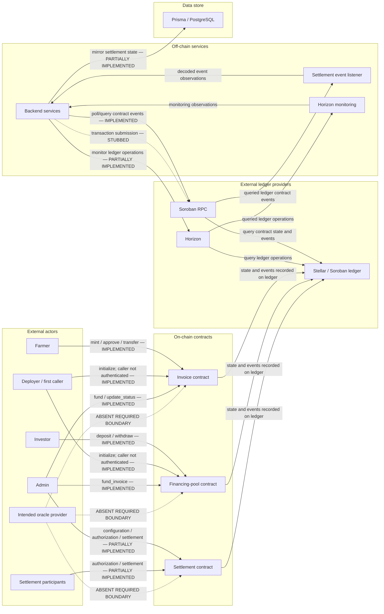

# InvoiceFi Protocol Threat Model

## Document Status

- **Status:** Initial threat model
- **Scope:** Protocol/application level
- **Issue:** [#86 — Threat model document covering all protocol actors, trust boundaries, and attack surface](https://github.com/Nova-reward/InvoiceFi-Stellar/issues/86)
- **Security review:** Pending
- **Last reviewed:** Not yet reviewed

A contributor with a security background must review this document before merge. No reviewer has been assigned or recorded yet.

## 1. Purpose

This document is the baseline threat model for future security audits, implementation reviews, and adversarial testing of InvoiceFi. It records security-relevant behavior evidenced by the repository, distinguishes implemented controls from intended or missing integrations, and identifies residual risks without treating protocol documentation as proof of implementation.

## 2. System Overview

InvoiceFi contains three Soroban contracts:

- The **invoice contract** lets an authenticated supplied owner mint an invoice, and lets the configured admin fund invoices and drive lifecycle status transitions. The admin does not mint invoices.
- The **financing-pool contract** authenticates investor deposits and withdrawals and lets the configured admin create discounted funding advances. Its balances and available-liquidity values are internal accounting; the repository does not demonstrate token custody transfers.
- The **settlement contract** contains admin configuration, settlement authorization, fee accounting, escrow-key configuration, and nonce-aware settlement operations. It is outside the current Cargo workspace and normal CI test path.

The backend reads Soroban RPC events and synchronizes settlement observations. It also monitors Horizon ledger operations. The Soroban transaction-submission service is stubbed and must not be described as a completed transaction executor. Prisma/PostgreSQL stores the off-chain mirror.

The invoice, financing-pool, and settlement contracts do not call one another. Protocol sequencing and cross-contract consistency therefore rely on off-chain orchestration and reconciliation. No implemented oracle-to-contract integration exists. Horizon monitoring is monitoring, not an oracle.

### Implementation status

| Area | Status | Evidence and interpretation |
|---|---|---|
| Invoice minting and ownership | Implemented | `invoice::mint` authenticates the supplied `owner`; admin authorization is used for funding and status updates. |
| Pool deposits, withdrawals, and internal funding accounting | Implemented, with custody limitation | `financing_pool::deposit`, `withdraw`, and `fund_invoice` update internal balances; demonstrated token custody transfer is absent. |
| Settlement configuration and settlement operations | Partially implemented | Settlement entrypoints exist, including admin checks, settlement authorization, fee handling, escrow-key storage, and nonce checks. |
| Settlement build and CI visibility | Assurance gap | The settlement crate is excluded from the current workspace and normal CI path. |
| Soroban RPC event reading and settlement synchronization | Implemented, with reconciliation limitations | Backend services query and decode RPC events and apply settlement observations. |
| Horizon monitoring | Implemented | The backend polls/streams Horizon ledgers and operations for monitoring. |
| Soroban transaction submission | Stubbed | `backend/src/soroban/soroban.service.ts` throws `Not implemented` for funding and settlement submission. |
| Oracle-to-contract integration | Required but absent | No contract boundary verifies external crop-yield or price attestations. |

## 3. Scope

### In Scope

- Protocol-level trust boundaries
- Smart-contract authorization
- Protocol state integrity
- Off-chain/on-chain reconciliation
- Event ingestion
- Oracle assumptions
- Privileged administration
- Replay and lifecycle risks
- Protocol-level misuse of RPC data and transaction processing

### Out of Scope

- Host and container hardening
- Firewall and network topology
- TLS termination infrastructure
- Cloud-provider configuration
- Generic DDoS infrastructure protection
- Wallet-device malware
- Penetration testing
- Production key-custody implementation details not present in the repository

## 4. Security Objectives

- Preserve invoice integrity and truthful lifecycle state.
- Preserve ownership integrity for invoice tokens and approvals.
- Preserve pool-liquidity integrity and investor claims.
- Ensure settlement correctness and bounded fee accounting.
- Require authenticated external truth before any future oracle-driven decision.
- Preserve lifecycle consistency across contracts and the off-chain mirror.
- Resist transaction and authorization replay.
- Make privileged actions accountable and governable.
- Keep on-chain and off-chain state consistent and recoverable.
- Preserve service recoverability during RPC, submission, or component failures.

## 5. Assets

| Asset | Why it matters |
|---|---|
| Invoice records and lifecycle status | Incorrect amount, owner, due date, or status can create invalid financing or settlement. |
| Invoice ownership and persistent approvals | These determine who can transfer an invoice and who may act on an owner’s behalf. |
| Pool balances, available liquidity, and funding records | These determine investor claims and the amount available for advances. |
| Settlement records and authorization flags | These determine whether settlement is considered authorized and how much principal is paid. |
| Fee totals and escrow public-key configuration | Incorrect values can redirect or misprice settlement flows. |
| Nonce state | Replay protection depends on used-nonce and validity state. |
| Contract admin identity | The configured admin controls high-impact lifecycle and configuration operations. |
| Backend event cursor and settlement mirror | Stale or incorrect mirror state can cause operational decisions to diverge from the ledger. |
| External truth attestations | Future yield or price decisions require authenticity, freshness, and invoice binding. |

## 6. Actors and Components

- **Farmer:** Supplies an owner-authenticated invoice mint request and may own or transfer a tokenized invoice.
- **Investor:** Supplies authenticated pool liquidity and may withdraw an internal claim subject to pool checks.
- **Admin:** Configured contract administrator for funding, lifecycle, settlement configuration, fee, and escrow operations.
- **Intended oracle provider:** Required future provider of authenticated crop-yield or price truth; no implemented boundary exists.
- **Invoice contract:** Invoice records, ownership, tokenization, approvals, and lifecycle state.
- **Financing-pool contract:** Investor accounting, available liquidity, and discounted funding records.
- **Settlement contract:** Settlement records, authorization flags, fees, escrow-key configuration, and nonce-aware settlement.
- **Backend services:** Application services that read ledger data, synchronize observations, and expose application workflows.
- **Settlement event listener:** Soroban RPC event reader and decoder used by settlement synchronization.
- **Horizon monitoring:** Ledger and operation monitoring with anomaly detection and alert dispatch.
- **Soroban RPC:** Ledger/event query provider used by backend services.
- **Horizon:** Stellar ledger and operation monitoring provider.
- **Prisma/PostgreSQL:** Off-chain persistence for the application mirror.

## 7. Assumptions and Known Gaps

- Deployment-time initialization atomicity is not proven by repository evidence.
- Admin-key custody is deployment-dependent and is not defined by the contracts.
- No oracle-to-contract integration exists.
- Backend transaction submission is stubbed.
- The settlement crate is outside the workspace and normal CI path.
- The contracts do not enforce cross-contract invariants.
- Production RPC/Horizon provider configuration is not documented in this repository.
- Public Stellar account, contract, transaction, and event identifiers are expected to be observable and are not treated as confidential assets.
- The threat register describes protocol/application misuse and failure modes, not infrastructure or penetration-test findings.

## 8. Data Flow Diagram

**Legend:** Solid arrows are implemented or partially implemented data flows. Dotted arrows identify an absent required boundary or a stubbed operation. Initialization is implemented but currently lacks caller authentication. Contracts record state and events on the Stellar / Soroban ledger; Soroban RPC and Horizon query that ledger, so contracts do not directly communicate with RPC. The five trust boundaries are Farmer ↔ contract, Investor ↔ contract, Oracle ↔ contract, Backend ↔ Horizon/Soroban RPC, and Admin ↔ contracts.

## 9. Trust Boundaries

### TB-1: Farmer ↔ contract

- **Components:** Farmer and invoice contract.
- **Data crossing:** Owner address, amount, crop symbol, due date, metadata, approvals, and transfer requests.
- **Authentication:** `mint` authenticates the supplied owner; approval and direct transfer authenticate the relevant owner; delegated transfer authenticates the spender.
- **Validation:** Positive mint amounts, ownership checks, tokenization checks, approval checks, and lifecycle transfer restrictions.
- **Assets at risk:** Invoice records, ownership, transfer permissions, and metadata.
- **Current status:** Implemented for the exposed invoice operations.
- **Limitations:** Minted metadata and due dates have no demonstrated semantic bounds; persistent approvals have no demonstrated expiry or explicit revocation entrypoint.

### TB-2: Investor ↔ contract

- **Components:** Investor and financing-pool contract.
- **Data crossing:** Deposit and withdrawal addresses and amounts.
- **Authentication:** Depositor or withdrawal recipient must authenticate.
- **Validation:** Positive amounts, internal balance checks, and available-liquidity checks.
- **Assets at risk:** Investor claims, available liquidity, and funding accounting.
- **Current status:** Implemented internal accounting.
- **Limitations:** The repository does not demonstrate token custody transfer or cryptographic binding between pool accounting and real settlement-token balances.

### TB-3: Oracle ↔ contract

- **Components:** Intended oracle provider and the three contracts.
- **Data crossing:** Future crop-yield, price, or repayment attestations bound to invoice identifiers.
- **Authentication:** None implemented.
- **Validation:** None implemented at a contract oracle boundary.
- **Assets at risk:** Invoice validity, settlement decisions, pricing, and investor claims.
- **Current status:** Absent required boundary.
- **Limitations:** Horizon monitoring is not an oracle and cannot prove external agricultural truth.

### TB-4: Backend ↔ Horizon/Soroban RPC

- **Components:** Backend services, settlement event listener, Horizon monitoring, Horizon, and Soroban RPC.
- **Data crossing:** Ledger sequences, contract events, operation records, transaction submission requests, and decoded event values.
- **Authentication:** Provider configuration and SDK calls are present; the repository does not establish production provider trust or transaction-signing behavior.
- **Validation:** Event filters and XDR decoding exist; strict reconciliation and submission confirmation are incomplete.
- **Assets at risk:** Event chronology, off-chain settlement state, monitoring decisions, and transaction outcome handling.
- **Current status:** Event reading and monitoring implemented; submission stubbed.
- **Limitations:** Duplicate, delayed, reordered, malformed, misattributed, or provider-mismatched data can affect the mirror unless stronger reconciliation is added.

### TB-5: Admin ↔ contracts

- **Components:** Admin and invoice, financing-pool, and settlement contracts.
- **Data crossing:** Initialization, lifecycle transitions, funding instructions, settlement records, fee rates, escrow keys, fee withdrawals, and settlement configuration.
- **Authentication:** Admin checks exist for most privileged entrypoints; invoice and pool initialization do not call `require_auth`; settlement uses a single stored admin.
- **Validation:** Local amount, state, and one-time initialization checks exist, but cross-contract and governance checks are limited.
- **Assets at risk:** Core protocol state, fees, escrow trust, funding state, and availability of the protocol.
- **Current status:** Partially implemented single-admin model.
- **Limitations:** No demonstrated multisig, role separation, timelock, emergency pause, or deployment-atomic initialization policy.

## 10. Risk Rating Methodology

Likelihood:

- LOW: requires exceptional access, unlikely conditions, or multiple independent failures
- MEDIUM: plausible with meaningful access, preparation, or a realistic component failure
- HIGH: readily achievable by a relevant attacker or likely during normal component compromise/failure

Impact:

- LOW: limited inconvenience or negligible protocol-state effect
- MEDIUM: recoverable incorrect state, limited disruption, or bounded financial/reputational loss
- HIGH: material loss, persistent protocol inconsistency, unauthorized privileged mutation, or prolonged unavailability
- CRITICAL: systemic loss, unrestricted control over core protocol state, or irreversible compromise affecting most participants

Severity matrix:

| Likelihood | LOW impact | MEDIUM impact | HIGH impact | CRITICAL impact |
|---|---:|---:|---:|---:|
| LOW | LOW | LOW | MEDIUM | MEDIUM |
| MEDIUM | LOW | MEDIUM | HIGH | CRITICAL |
| HIGH | MEDIUM | HIGH | HIGH | CRITICAL |

## 11. STRIDE Threat Register

Every row uses exactly one required trust-boundary name. “Evidence” cites repository paths and function names rather than unstable line numbers.

| ID | STRIDE | Trust boundary | Surface | Threat scenario | Likelihood | Impact | Severity | Existing mitigation | Status | Recommended mitigation | Evidence | Tracking issue |
|---|---|---|---|---|---|---|---|---|---|---|---|---|
| TM-E-001 | Elevation of Privilege | Admin ↔ contracts | Invoice `initialize` | An unauthorized first caller initializes the invoice contract with an attacker-controlled admin and later controls privileged lifecycle operations. | MEDIUM | HIGH | HIGH | One-time initialization guard prevents reinitialization. | OPEN | Require authenticated deployer-only initialization or prove an atomic deployment bootstrap that supplies the intended admin. | `contracts/invoice/src/lib.rs`, `InvoiceContract::initialize` has no `require_auth`. | [#43 — Role-based access control with multisig admin support across all contracts](https://github.com/Nova-reward/InvoiceFi-Stellar/issues/43) |
| TM-E-002 | Elevation of Privilege | Admin ↔ contracts | Financing-pool `initialize` | An unauthorized first caller initializes the pool with an attacker-controlled admin and later controls funding operations. | MEDIUM | HIGH | HIGH | One-time initialization guard and discount bound. | OPEN | Require authenticated deployer-only initialization or prove atomic deployment bootstrap. | `contracts/financing-pool/src/lib.rs`, `FinancingPoolContract::initialize` has no `require_auth`. | [#43 — Role-based access control with multisig admin support across all contracts](https://github.com/Nova-reward/InvoiceFi-Stellar/issues/43) |
| TM-E-003 | Elevation of Privilege | Admin ↔ contracts | Settlement `settlement_auth` | Any authenticated caller can alter settlement authorization flags by choosing `did_pay`, `is_buyer`, and `is_payee`; the function does not verify that the caller is the borrower, financier, payer, or admin. | HIGH | HIGH | HIGH | `caller.require_auth()` and invoice-record existence check. | OPEN | Enforce the caller’s stored role and validate each flag against the corresponding participant. | `contracts/settlement/src/lib.rs`, `SettlementContract::settlement_auth`. | [#43 — Role-based access control with multisig admin support across all contracts](https://github.com/Nova-reward/InvoiceFi-Stellar/issues/43) |
| TM-T-004 | Tampering | Admin ↔ contracts | Settlement `request_settlement_auth` | A participant-role confusion or inconsistent record can let a caller satisfy a payer or financier authorization path that was not intended for that caller. | MEDIUM | HIGH | HIGH | Caller is compared with stored borrower or financier before setting the corresponding flag. | PARTIAL | Model roles explicitly, reject ambiguous borrower/financier identities, and require the intended multi-party authorization sequence. | `contracts/settlement/src/lib.rs`, `SettlementContract::request_settlement_auth`; `set_invoice_data` controls stored roles. | [#43 — Role-based access control with multisig admin support across all contracts](https://github.com/Nova-reward/InvoiceFi-Stellar/issues/43) |
| TM-T-005 | Tampering | Admin ↔ contracts | Settlement `set_fee_rate` | The admin can set any `u32` fee rate, including economically unsafe values, because no upper or lower policy bound is enforced. | MEDIUM | HIGH | HIGH | Admin authentication. | OPEN | Enforce a protocol fee-rate range, reject invalid rates, and govern changes through multisig or timelock. | `contracts/settlement/src/lib.rs`, `SettlementContract::set_fee_rate` stores `fee_rate` without bounds. | [#43 — Role-based access control with multisig admin support across all contracts](https://github.com/Nova-reward/InvoiceFi-Stellar/issues/43) |
| TM-T-006 | Tampering | Admin ↔ contracts | Settlement `set_invoice_data` | An authenticated admin can overwrite an existing settlement record or register data inconsistent with the invoice and pool contracts. | MEDIUM | HIGH | HIGH | Admin authentication and local record construction. | OPEN | Reject overwrites by default and verify invoice existence, owner, amount, due date, and funding state across contracts. | `contracts/settlement/src/lib.rs`, `SettlementContract::set_invoice_data` writes `invoice_data` without an existence or cross-contract check. | [#43 — Role-based access control with multisig admin support across all contracts](https://github.com/Nova-reward/InvoiceFi-Stellar/issues/43) |
| TM-T-007 | Tampering | Admin ↔ contracts | Settlement `set_escrow_pubkey` | The admin can replace the escrow public key without rotation controls, validation policy, or a second-party approval. | MEDIUM | HIGH | HIGH | Admin authentication and fixed `BytesN<32>` type. | OPEN | Add controlled rotation, explicit key-state validation, delay, and multisig approval. | `contracts/settlement/src/lib.rs`, `SettlementContract::set_escrow_pubkey`. | [#43 — Role-based access control with multisig admin support across all contracts](https://github.com/Nova-reward/InvoiceFi-Stellar/issues/43) |
| TM-T-008 | Tampering | Admin ↔ contracts | Invoice lifecycle transitions | An admin can move an invoice through terminal lifecycle states without a challenge or arbitration window, making a mistaken or abusive transition immediately authoritative. | MEDIUM | HIGH | HIGH | Allowed-transition state machine and admin authentication. | PARTIAL | Add a challenge window, dispute path, or multi-party approval for terminal transitions. | `contracts/invoice/src/lib.rs`, `InvoiceContract::update_status` and `transition_allowed`. | [#54 — Dispute window and arbitration logic for challenged yield attestations in settlement contract](https://github.com/Nova-reward/InvoiceFi-Stellar/issues/54) |
| TM-T-009 | Tampering | Admin ↔ contracts | Invoice/pool funding sequence | Admin-orchestrated funding can update invoice and pool state inconsistently because the contracts do not call one another or enforce a shared invariant. | MEDIUM | HIGH | HIGH | Local invoice status, duplicate-funding, amount, and liquidity checks. | PARTIAL | Add atomic cross-contract orchestration or verifiable reconciliation before accepting funding state. | `contracts/invoice/src/lib.rs`, `contracts/financing-pool/src/lib.rs`; no cross-contract calls. | [#70 — Contract integration test harness covering all state machine transitions and edge cases](https://github.com/Nova-reward/InvoiceFi-Stellar/issues/70) |
| TM-T-010 | Tampering | Admin ↔ contracts | Settlement `withdraw_fees` | A compromised or overly powerful admin can withdraw protocol fees subject only to the stored balance, reducing reserves or changing economic outcomes. | MEDIUM | HIGH | HIGH | Admin authentication and amount-versus-collected-fees check. | PARTIAL | Add reserve limits, withdrawal policy, timelock, and multisig authorization. | `contracts/settlement/src/lib.rs`, `SettlementContract::withdraw_fees`. | [#43 — Role-based access control with multisig admin support across all contracts](https://github.com/Nova-reward/InvoiceFi-Stellar/issues/43) |
| TM-T-011 | Tampering | Admin ↔ contracts | Settlement nonce and mutating paths | A settlement operation is replayed or retried across a path that is not covered by the same nonce or idempotency rules as `settle_invoice`. | MEDIUM | HIGH | HIGH | `settle_invoice` checks and marks a nonce. | PARTIAL | Apply nonce or application-level idempotency to every mutating Soroban entrypoint and backend retry path. | `contracts/settlement/src/lib.rs`, `SettlementContract::settle_invoice`; other settlement mutators do not use the nonce. | [#44 — Replay attack prevention and application-level idempotency for all Soroban entry points](https://github.com/Nova-reward/InvoiceFi-Stellar/issues/44) |
| TM-T-012 | Tampering | Backend ↔ Horizon/Soroban RPC | Event synchronization | Duplicate, delayed, reordered, or malformed RPC events can cause settlement observations to be applied twice, late, or incorrectly. | MEDIUM | MEDIUM | MEDIUM | RPC event decoding, ledger cursor, and settlement synchronization exist. | PARTIAL | Make event application replay-safe, persist durable cursors, deduplicate by ledger/event identity, and reconcile state. | `backend/src/settlement/soroban-events.service.ts`, `backend/src/settlement/settlement-sync.service.ts`. | NO VERIFIED OPEN ISSUE — BLOCKED: maintainer must create or approve a tracking issue |
| TM-D-013 | Denial of Service | Backend ↔ Horizon/Soroban RPC | Soroban submission | The backend cannot complete a requested funding or settlement transaction because the submission methods are stubbed, leaving the workflow incomplete or unavailable. | HIGH | HIGH | HIGH | Typed contract-error parsing exists, but no submission implementation exists. | OPEN | Implement transaction build, signing, submission, confirmation, fee-bump retry, sequence locking, and result classification. | `backend/src/soroban/soroban.service.ts`, `fundInvoice` and `settleInvoice` throw `Not implemented`. | [#59 — Stellar transaction submission reliability: fee-bump retry, sequence locking, and result classification](https://github.com/Nova-reward/InvoiceFi-Stellar/issues/59) |
| TM-R-014 | Repudiation | Backend ↔ Horizon/Soroban RPC | Event auditability | Without durable append-only event chronology and correlation, a disputed settlement may not be provable from the backend mirror alone. | MEDIUM | MEDIUM | MEDIUM | Settlement events are decoded and synchronized. | PARTIAL | Persist append-only event identities, transaction hashes, ledger sequence, cursor, and correlation identifiers. | `backend/src/settlement/soroban-events.service.ts`, `backend/src/settlement/settlement-sync.service.ts`. | [#58 — Event-sourcing architecture for invoice lifecycle audit trail with append-only event store](https://github.com/Nova-reward/InvoiceFi-Stellar/issues/58) |
| TM-T-015 | Tampering | Backend ↔ Horizon/Soroban RPC | Contract event attribution | If an event is accepted without strict expected contract-ID and topic binding, an event from another contract or topic can be interpreted as a settlement signal. | MEDIUM | MEDIUM | MEDIUM | Configured contract filters and topic decoding exist. | PARTIAL | Enforce contract-ID, event-topic, ledger, and schema validation before state mutation. | `backend/src/settlement/soroban-events.service.ts`, `fetchEvents` and `normalize`; parser path in `backend/src/settlement/settlement-event.parser.ts`. | NO VERIFIED OPEN ISSUE — BLOCKED: maintainer must create or approve a tracking issue |
| TM-S-016 | Spoofing | Oracle ↔ contract | Future oracle boundary | A false crop-yield or price attestation could be accepted by a future integration because no authenticated oracle-to-contract boundary exists today. | MEDIUM | HIGH | HIGH | No oracle integration is implemented. | OPEN | Add signer identity, invoice-bound attestation, freshness, and contract-side verification. | No oracle call or verifier exists in the contracts; monitoring in `backend/src/monitoring/horizon-monitor.service.ts` is not an oracle. | [#50 — Off-chain crop yield verification pipeline with cryptographic attestation bound to invoice IDs](https://github.com/Nova-reward/InvoiceFi-Stellar/issues/50) |
| TM-D-017 | Denial of Service | Oracle ↔ contract | Future oracle liveness | A future oracle becomes stale or unavailable, leaving invoices unable to progress or causing fallback behavior to use obsolete truth. | MEDIUM | HIGH | HIGH | No oracle fallback or oracle contract path exists. | OPEN | Define freshness windows, liveness monitoring, safe fallback, and operator alerting before deployment. | Oracle integration is absent; the repository’s Horizon monitor is not an oracle feed. | [#49 — Oracle liveness monitoring service with automated fallback strategy and alerting](https://github.com/Nova-reward/InvoiceFi-Stellar/issues/49) |
| TM-T-018 | Tampering | Oracle ↔ contract | Future oracle submissions | A future oracle submission is replayed or front-run so a stale or attacker-selected value is applied to an invoice. | MEDIUM | HIGH | HIGH | No oracle submission mechanism exists. | OPEN | Bind submissions to invoice IDs and epochs and use commit-reveal or equivalent anti-front-running controls. | No oracle submission or verification entrypoint exists in the contracts. | [#53 — Commit-reveal scheme for oracle price submissions to prevent front-running](https://github.com/Nova-reward/InvoiceFi-Stellar/issues/53) |
| TM-T-019 | Tampering | Farmer ↔ contract | Invoice approvals | A persistent spender approval remains usable longer than intended after a wallet compromise because no approval expiry or explicit revocation entrypoint is demonstrated. | MEDIUM | MEDIUM | MEDIUM | Owner authentication, single spender storage, and approval consumption on transfer. | PARTIAL | Add expiry, amount limits, and explicit revoke/clear approval semantics. | `contracts/invoice/src/lib.rs`, `InvoiceContract::approve` stores persistent approval and `transfer_from` consumes it only after transfer. | NO VERIFIED OPEN ISSUE — BLOCKED: maintainer must create or approve a tracking issue |
| TM-T-020 | Tampering | Farmer ↔ contract | Invoice metadata and due date | A caller can mint a positive-value invoice with arbitrary metadata or due date because semantic bounds are not enforced, creating inconsistent or unusable protocol records. | MEDIUM | MEDIUM | MEDIUM | Positive amount check and owner authentication. | OPEN | Validate metadata schema, crop identifiers, due-date range, and ledger-time relationship. | `contracts/invoice/src/lib.rs`, `InvoiceContract::mint` accepts `metadata` and `due_date` without demonstrated bounds. | NO VERIFIED OPEN ISSUE — BLOCKED: maintainer must create or approve a tracking issue |
| TM-T-021 | Tampering | Investor ↔ contract | Pool accounting and custody | Internal pool balances can diverge from real settlement-token custody because deposits, withdrawals, and funding update accounting without demonstrated token transfers. | MEDIUM | HIGH | HIGH | Authenticated deposit/withdrawal and balance/liquidity checks. | OPEN | Bind accounting to token contract transfers and add invariant checks between custody and recorded balances. | `contracts/financing-pool/src/lib.rs`, `deposit`, `withdraw`, and `fund_invoice` update internal values; no demonstrated token transfer. | [#47 — Economic attack simulation: flash-loan-style and pool manipulation vectors in financing pool](https://github.com/Nova-reward/InvoiceFi-Stellar/issues/47) |
| TM-D-022 | Denial of Service | Admin ↔ contracts | Admin key availability | Loss or lockout of the single configured admin can prevent funding, lifecycle updates, settlement configuration, and fee operations. | MEDIUM | HIGH | HIGH | Admin identity is stored and checked by privileged functions. | OPEN | Use multisig, admin rotation, recovery, and operational key-availability procedures. | `contracts/invoice/src/lib.rs`, `contracts/financing-pool/src/lib.rs`, and `contracts/settlement/src/lib.rs` use a single configured admin. | [#43 — Role-based access control with multisig admin support across all contracts](https://github.com/Nova-reward/InvoiceFi-Stellar/issues/43) |
| TM-D-023 | Denial of Service | Admin ↔ contracts | Incident response | Unsafe state-changing operations cannot be paused through a demonstrated emergency control while an incident is investigated. | MEDIUM | HIGH | HIGH | No pause or circuit-breaker control is evidenced in the contracts. | OPEN | Add a circuit breaker with explicit user-exit guarantees and narrowly scoped recovery authority. | No pause entrypoint is present in the reviewed invoice, pool, or settlement contract surfaces. | [#46 — Circuit breaker and emergency pause mechanism with user-exit guarantees](https://github.com/Nova-reward/InvoiceFi-Stellar/issues/46) |
| TM-T-024 | Tampering | Backend ↔ Horizon/Soroban RPC | Provider and contract configuration | A configuration mismatch causes the backend to observe the wrong network, ledger, or contract ID and apply plausible but incorrect observations to the mirror. | MEDIUM | MEDIUM | MEDIUM | URLs and contract IDs are configuration-driven; RPC event filters can use configured IDs. | OPEN | Validate network identity, contract IDs, ledger continuity, and provider health at startup and during polling. | `backend/src/settlement/soroban-events.service.ts` reads `STELLAR_RPC_URL` and `INVOICE_CONTRACT_ID`; production provider configuration is not documented. | NO VERIFIED OPEN ISSUE — BLOCKED: maintainer must create or approve a tracking issue |

## 12. Existing Security Controls

| Control | Evidence | Limitation | Test/CI status |
|---|---|---|---|
| Owner authentication for invoice minting | `contracts/invoice/src/lib.rs`, `InvoiceContract::mint` | Caller chooses the supplied owner; metadata and due-date semantics are not bounded. | Invoice tests include owner-auth behavior and run in the workspace path. |
| Admin authentication for invoice funding and lifecycle updates | `contracts/invoice/src/lib.rs`, `fund`, `update_status` | Single-admin trust; no multisig or challenge window. | Invoice tests cover admin-auth paths in the workspace. |
| Authenticated pool deposits and withdrawals | `contracts/financing-pool/src/lib.rs`, `deposit`, `withdraw` | Internal accounting is not demonstrated token custody. | Pool tests run in the workspace path. |
| Admin-authenticated pool funding | `contracts/financing-pool/src/lib.rs`, `fund_invoice` | No cross-contract invoice-state check. | Pool tests cover admin-auth and liquidity paths in the workspace. |
| Settlement admin checks | `contracts/settlement/src/lib.rs`, configuration and fee functions | Settlement is outside normal workspace CI; role and governance controls are incomplete. | Settlement tests are not executed by normal workspace CI. |
| Settlement nonce check | `contracts/settlement/src/lib.rs`, `settle_invoice` | Not applied uniformly to all mutating settlement paths. | Settlement-specific tests exist in the separate crate, but normal workspace CI excludes it. |
| Soroban RPC event decoding | `backend/src/settlement/soroban-events.service.ts` | Duplicate, malformed, and reconciliation handling require strengthening. | Backend dependency tests were not executed in this analysis because dependencies were not installed. |
| Horizon monitoring | `backend/src/monitoring/horizon-monitor.service.ts` | Monitoring does not authenticate an oracle truth source or submit contract transactions. | Backend dependency tests were not executed in this analysis because dependencies were not installed. |

## 13. Open Mitigation Gaps

### Privileged initialization and administration

- **#43 — Role-based access control with multisig admin support across all contracts:** TM-E-001, TM-E-002, TM-E-003, TM-T-004, TM-T-005, TM-T-006, TM-T-007, TM-T-010, and TM-D-022. The issue should explicitly include authenticated/deployer-only initialization, role checks for settlement authorization, configuration bounds, and admin recovery where applicable.

### Replay and idempotency

- **#44 — Replay attack prevention and application-level idempotency for all Soroban entry points:** TM-T-011. The acceptance criteria should cover settlement authorization and backend retries, not only `settle_invoice`.

### Incident containment

- **#46 — Circuit breaker and emergency pause mechanism with user-exit guarantees:** TM-D-023.

### Pool economic integrity

- **#47 — Economic attack simulation: flash-loan-style and pool manipulation vectors in financing pool:** TM-T-021.

### Oracle reliability and authenticity

- **#49 — Oracle liveness monitoring service with automated fallback strategy and alerting:** TM-D-017.
- **#50 — Off-chain crop yield verification pipeline with cryptographic attestation bound to invoice IDs:** TM-S-016.
- **#53 — Commit-reveal scheme for oracle price submissions to prevent front-running:** TM-T-018.
- **#54 — Dispute window and arbitration logic for challenged yield attestations in settlement contract:** TM-T-008.

### Event and transaction reliability

- **#58 — Event-sourcing architecture for invoice lifecycle audit trail with append-only event store:** TM-R-014.
- **#59 — Stellar transaction submission reliability: fee-bump retry, sequence locking, and result classification:** TM-D-013. This issue must include implementing the currently missing submission path, not only hardening a path that already exists.
- **#61 — Structured logging, OpenTelemetry distributed tracing, and correlation ID propagation across the stack:** Relevant operational support for provider mismatch investigation, but it does not fully track TM-T-024, which remains blocked in the register.

### Partial issue coverage

- **#70** currently provides integration-test tracking for TM-T-009, but its acceptance criteria should also cover enforcement or reconciliation of cross-contract invariants.
- **#47** tracks economic attack analysis for TM-T-021, but its acceptance criteria should explicitly cover the invariant between recorded pool balances and real token custody.
- **#54** only partially covers the general terminal-lifecycle challenge-window risk and should be expanded if it is intended to resolve TM-T-008.

### Tracking limitation

This document only links existing issues supplied for the review. Maintainers must expand issue acceptance criteria when an existing issue only partially covers a threat. Medium risks without a genuinely relevant existing issue are intentionally marked as blocked rather than mapped by title similarity.

## 14. Assurance and Testing Gaps

- The settlement contract is excluded from the Cargo workspace and normal CI path. See [#98 — settlement contract fails to build and is excluded from the Cargo workspace (invisible to CI)](https://github.com/Nova-reward/InvoiceFi-Stellar/issues/98). This is an assurance gap, not a STRIDE threat in the register.
- Full cross-contract integration coverage is not demonstrated. See [#70 — Contract integration test harness covering all state machine transitions and edge cases](https://github.com/Nova-reward/InvoiceFi-Stellar/issues/70). Missing tests are not counted as a STRIDE threat.
- Backend dependency tests were not executed in this analysis because dependencies were not installed.
- Threat-model conclusions are based on static repository evidence and must be revisited after integration work, oracle implementation, transaction-submission implementation, and deployment changes.

## 15. Residual Risk

Even after the mapped mitigations are implemented, residual risk will remain around real-world oracle quality, admin operational security, provider availability, ledger finality assumptions, cross-contract sequencing, and economic behavior under adverse market conditions. A passing unit or integration suite will not prove production key custody, external data truth, or infrastructure resilience. Those concerns require separate operational controls and adversarial testing.

## 16. Out-of-Scope Concerns

Host and container hardening, firewall and network topology, TLS termination infrastructure, cloud-provider configuration, generic DDoS infrastructure protection, wallet-device malware, penetration testing, and production key-custody implementation details are outside this protocol/application threat model. They remain important security work and must be assessed through appropriate infrastructure, operational, and penetration-testing processes. Protocol-level misuse of RPC data and transaction processing remains in scope here.

## 17. Review and Maintenance Process

- Security review is required before merge.
- Review status is currently pending.
- Add a completed review record only when a contributor with a security background has reviewed the document.

| Reviewer | Security background | Date | Result |
|---|---|---|---|
| Pending | Pending | Pending | Required before merge |

Update this model when there is:

- a new contract entrypoint
- an authorization change
- an oracle implementation
- a backend transaction-submission implementation
- cross-contract integration
- an admin or governance change
- a new HIGH or CRITICAL issue
- a production incident

Suggested cadence: review before each security-sensitive release, after every trigger above, and at least quarterly while the protocol is under active development.

## 18. References

### Repository sources

- [Invoice contract](../../contracts/invoice/src/lib.rs)
- [Financing-pool contract](../../contracts/financing-pool/src/lib.rs)
- [Settlement contract](../../contracts/settlement/src/lib.rs)
- [Soroban submission service](../../backend/src/soroban/soroban.service.ts)
- [Soroban event service](../../backend/src/settlement/soroban-events.service.ts)
- [Settlement synchronization](../../backend/src/settlement/settlement-sync.service.ts)
- [Horizon monitoring](../../backend/src/monitoring/horizon-monitor.service.ts)
- [Protocol specification](../protocol-spec.md)
- [Contract security notes](../../contracts/SECURITY.md)
- [Contract workspace manifest](../../contracts/Cargo.toml)

### Related issues

- [#43 — Role-based access control with multisig admin support across all contracts](https://github.com/Nova-reward/InvoiceFi-Stellar/issues/43)
- [#44 — Replay attack prevention and application-level idempotency for all Soroban entry points](https://github.com/Nova-reward/InvoiceFi-Stellar/issues/44)
- [#46 — Circuit breaker and emergency pause mechanism with user-exit guarantees](https://github.com/Nova-reward/InvoiceFi-Stellar/issues/46)
- [#47 — Economic attack simulation: flash-loan-style and pool manipulation vectors in financing pool](https://github.com/Nova-reward/InvoiceFi-Stellar/issues/47)
- [#49 — Oracle liveness monitoring service with automated fallback strategy and alerting](https://github.com/Nova-reward/InvoiceFi-Stellar/issues/49)
- [#50 — Off-chain crop yield verification pipeline with cryptographic attestation bound to invoice IDs](https://github.com/Nova-reward/InvoiceFi-Stellar/issues/50)
- [#53 — Commit-reveal scheme for oracle price submissions to prevent front-running](https://github.com/Nova-reward/InvoiceFi-Stellar/issues/53)
- [#54 — Dispute window and arbitration logic for challenged yield attestations in settlement contract](https://github.com/Nova-reward/InvoiceFi-Stellar/issues/54)
- [#58 — Event-sourcing architecture for invoice lifecycle audit trail with append-only event store](https://github.com/Nova-reward/InvoiceFi-Stellar/issues/58)
- [#59 — Stellar transaction submission reliability: fee-bump retry, sequence locking, and result classification](https://github.com/Nova-reward/InvoiceFi-Stellar/issues/59)
- [#61 — Structured logging, OpenTelemetry distributed tracing, and correlation ID propagation across the stack](https://github.com/Nova-reward/InvoiceFi-Stellar/issues/61)
- [#70 — Contract integration test harness covering all state machine transitions and edge cases](https://github.com/Nova-reward/InvoiceFi-Stellar/issues/70)
- [#86 — Threat model document covering all protocol actors, trust boundaries, and attack surface](https://github.com/Nova-reward/InvoiceFi-Stellar/issues/86)
- [#98 — settlement contract fails to build and is excluded from the Cargo workspace (invisible to CI)](https://github.com/Nova-reward/InvoiceFi-Stellar/issues/98)
